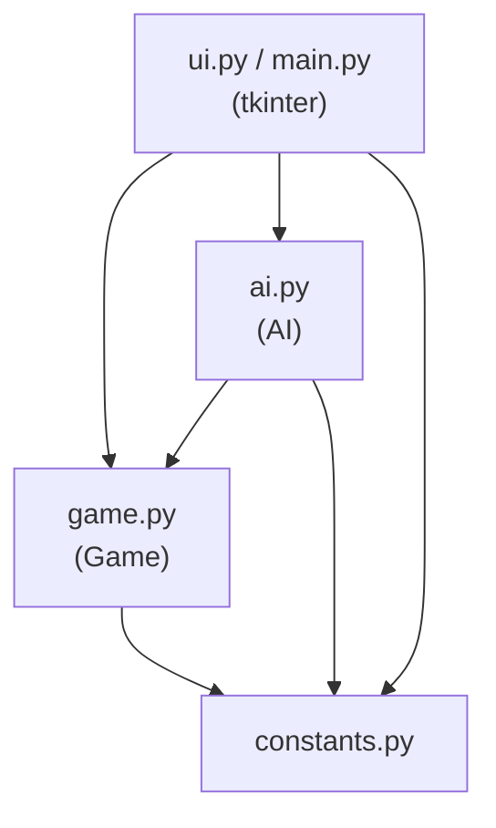
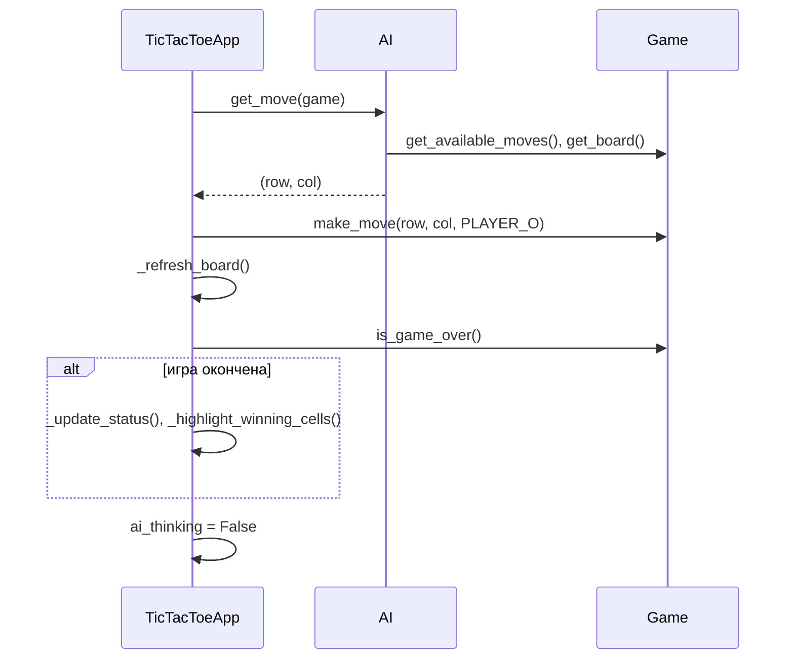
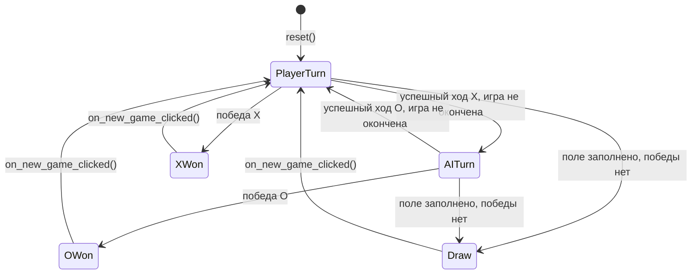

# Архитектура и план реализации: «Крестики-нолики 5×5»

> Документ подготовлен как продолжение `spec_0_base.md`.
> Здесь фиксируются конкретные архитектурные решения (там, где ТЗ
> оставляло свободу выбора) и пошаговый план реализации для Cursor.
> Автор придерживается принципов KISS, SOLID, separation of concerns,
> testability — как того требует раздел 31 ТЗ.

---

## 1. Итоговая структура проекта

Архитектура ТЗ (раздел 5) принимается без изменений — она уже
соответствует принципу разделения ответственности. Финальное дерево:

```text
04_crosses_zeros/
│
├── main.py            # точка входа, создание Tk-окна
├── constants.py        # настройки игры (без логики)
├── game.py             # игровая модель (без tkinter)
├── ai.py                # эвристический ИИ (без tkinter)
├── ui.py                # tkinter/ttk интерфейс
│
├── tests/
│   ├── __init__.py
│   ├── test_game.py
│   └── test_ai.py
│
└── README.md
```

Слои и направление зависимостей:



Зависимости идут только «сверху вниз»: `game.py` не знает о `ai.py`
и `ui.py`; `ai.py` не знает о `ui.py`. Это делает `game.py` и `ai.py`
полностью тестируемыми в изоляции и допускает замену UI (например,
на консольный интерфейс) без изменения логики и ИИ.

---

## 2. `constants.py` — настройки

Помимо констант, явно перечисленных в ТЗ, выделяю `WIN_LENGTH`
(указан в разделе 7 ТЗ как отдельная константа) и небольшой набор
UI-констант, чтобы в `ui.py` не было «магических» литералов:

```python
"""Настройки игры «Крестики-нолики 5×5».

Модуль не содержит игровой логики — только константы.
"""

BOARD_SIZE = 5
WIN_LENGTH = 5

PLAYER_X = "X"
PLAYER_O = "O"

EMPTY = ""

PLAYER_X_NAME = "Игрок"
PLAYER_O_NAME = "Компьютер"

WINDOW_TITLE = "Крестики-нолики 5×5"
WINDOW_SIZE = "700x800"
CELL_FONT = ("Arial", 24, "bold")

AI_MOVE_DELAY_MS = 300
```

`BOARD_SIZE` и `WIN_LENGTH` разделены сознательно (см. раздел 7
ТЗ): сегодня они равны, но алгоритм проверки победы не должен
опираться на это совпадение — это открывает путь к полю 10×10
с победой при 5-в-ряд без изменения `game.py`.

---

## 3. `game.py` — игровая модель

### 3.1. Ключевое архитектурное решение: единая функция проверки линии

ТЗ прямо требует «не делать 25 жёстко зашитых проверок» и выделить
проверку победы в отдельную функцию по 4 направлениям. Предлагаю
пойти на шаг дальше и построить на **одной чистой функции**,
которая закрывает сразу две задачи:

1. проверка реальной победы после хода в `Game.make_move`;
2. проверка «гипотетической» победы для `AI` (шаг 1 и 2 его
   алгоритма — «выиграю ли я здесь», «выиграет ли игрок здесь»).

```python
_DIRECTIONS: tuple[tuple[int, int], ...] = (
    (0, 1),   # горизонталь
    (1, 0),   # вертикаль
    (1, 1),   # диагональ
    (1, -1),  # обратная диагональ
)


def find_winning_line(
    board: list[list[str]],
    row: int,
    col: int,
    player: str,
) -> list[tuple[int, int]] | None:
    """Найти победную линию `player`, проходящую через (row, col).

    Клетка (row, col) считается занятой символом `player`
    независимо от того, что реально записано в `board` — это
    позволяет проверять как реальные, так и гипотетические ходы
    без мутации доски.

    Возвращает список из WIN_LENGTH координат линии победы
    или None, если победы нет.
    """
```

Реализация для каждого из 4 направлений считает подряд идущие
клетки `player` влево/вверх и вправо/вниз от `(row, col)`
(саму клетку считает совпадающей); если суммарная длина ≥
`WIN_LENGTH` — направление даёт победу, возвращается окно из
ровно `WIN_LENGTH` клеток, содержащее исходную точку.

Почему это удобно:

* нет мутации доски, нет `try/finally` с откатом временного хода;
* один и тот же код используется в `Game.check_winner` и в `AI` —
  ноль дублирования логики победы;
* легко покрывается unit-тестами независимо от `Game`.

### 3.2. Публичный API `Game` (как в ТЗ, без изменений сигнатур)

```python
class Game:
    """Игровая модель «Крестики-нолики 5×5».

    Хранит поле, применяет ходы, определяет победу и ничью.
    Не зависит от tkinter.
    """

    def __init__(self) -> None: ...
    def reset(self) -> None: ...
    def make_move(self, row: int, col: int, player: str) -> bool: ...
    def is_valid_move(self, row: int, col: int) -> bool: ...
    def check_winner(self, player: str) -> bool: ...
    def is_draw(self) -> bool: ...
    def is_game_over(self) -> bool: ...
    def get_winner(self) -> str | None: ...
    def get_available_moves(self) -> list[tuple[int, int]]: ...
    def get_winning_cells(self) -> list[tuple[int, int]]: ...
```

Две небольшие, но необходимые добавки к списку методов из ТЗ
(раздел 6 явно требует «предоставлять состояние игрового поля»,
но не называет метод):

```python
    def get_cell(self, row: int, col: int) -> str: ...
    def get_board(self) -> list[list[str]]: ...
```

* `get_cell` — точечное чтение для рендера одной кнопки в UI;
* `get_board` — **глубокая копия** поля для `AI` (чтобы ИИ
  анализировал состояние, но не мог случайно изменить реальную
  доску).

### 3.3. Разграничение обязанностей внутри `Game`

* `is_valid_move(row, col)` — проверяет **только** границы поля
  и то, что клетка пуста. Не знает о статусе игры и о том, чей
  сейчас ход.
* `make_move(row, col, player)` — оркестрирует правила более
  высокого уровня: если игра завершена → `False`; если
  `is_valid_move` вернул `False` → `False`; иначе ставит символ,
  вызывает `find_winning_line`, обновляет внутреннее состояние
  (`_winner`, `_winning_cells`, `_game_over`) и возвращает `True`.

Игра **не хранит и не проверяет очерёдность ходов** («чей сейчас
ход X или O») — параметр `player` передаётся вызывающей стороной
явно, как и требует сигнатура из ТЗ. Ответственность за то, что
ходы X и O чередуются правильно, лежит на `ui.py` (см. раздел 5).
Это осознанное упрощение — риски и меры описаны в разделе 8.

### 3.4. Внутреннее состояние (детали реализации, не публичный API)

```python
self._board: list[list[str]]
self._winner: str | None
self._winning_cells: list[tuple[int, int]]
self._game_over: bool
```

Состояние обновляется один раз, сразу после успешного хода —
`get_winner()`, `is_draw()`, `is_game_over()`, `get_winning_cells()`
просто отдают закешированные значения. Пересчёт всей доски на
каждый вызов не нужен: поле маленькое, но кеширование делает код
проще для чтения и избавляет от повторных сканирований.

---

## 4. `ai.py` — эвристический ИИ

### 4.1. Публичный API

```python
class AI:
    """Эвристический ИИ, играющий за PLAYER_O.

    Не зависит от tkinter. Детерминирован: не использует random.
    """

    def get_move(self, game: Game) -> tuple[int, int]: ...
```

Внутренняя декомпозиция (приватные методы/функции модуля):

```python
def _would_win(board, row, col, player) -> bool  # обёртка над
                                                   # find_winning_line
def _score_move(board, row, col) -> int
```

### 4.2. Алгоритм `get_move` (пять шагов ТЗ → код)

```python
def get_move(self, game: Game) -> tuple[int, int]:
    moves = sorted(game.get_available_moves())
    if not moves:
        raise ValueError("Нет доступных ходов для ИИ")

    board = game.get_board()

    for row, col in moves:                       # шаг 1: победа
        if _would_win(board, row, col, PLAYER_O):
            return row, col

    for row, col in moves:                       # шаг 2: блок
        if _would_win(board, row, col, PLAYER_X):
            return row, col

    best_move = moves[0]
    best_score = -1
    for row, col in moves:                        # шаг 3-6: score
        score = _score_move(board, row, col)
        if score > best_score:
            best_score = score
            best_move = row, col
    return best_move
```

Детерминизм (раздел 10 ТЗ) достигается тем, что `moves`
предварительно сортируется, а сравнение при подсчёте score —
строгое `>`, а не `>=`. Значит при равенстве очков остаётся
**первый** по порядку `(row, col)` — ровно правило
`min(candidate_moves)` из ТЗ, без явного `random` и без отдельной
ветки «выбрать минимальный из лучших».

### 4.3. `_score_move` — таблица весов (раздел 9 ТЗ)

| Фактор                                   | Вес   |
|-------------------------------------------|-------|
| клетка — центр поля                       | +10   |
| участие в «живой» линии с уже стоящим `O` | +6 за линию |
| участие в пустой «живой» линии            | +3 за линию |
| угловая клетка                            | +3    |
| прочие клетки                             | +1 (база) |

«Живая линия» — это одна из проходящих через клетку линий длины
`WIN_LENGTH` (строка/столбец/диагональ), в которой нет ни одного
`X`. Считается через ту же функцию `find_winning_line`-семейство
направлений (`_DIRECTIONS`), просто без требования «уже 5 в ряд» —
достаточно взять окно длины `WIN_LENGTH` в каждом направлении и
проверить отсутствие `X`. Веса — стартовые и легко настраиваемые
константы внутри `ai.py`, не влияющие на публичный API.

---

## 5. `ui.py` / `main.py` — интерфейс

### 5.1. Структура `TicTacToeApp`

```python
class TicTacToeApp:
    """Tkinter-интерфейс игры. Не определяет победителя сам —
    все решения запрашивает у Game и AI."""

    def __init__(self, root: tk.Tk) -> None: ...

    def _build_ui(self) -> None: ...
    def on_cell_clicked(self, row: int, col: int) -> None: ...
    def _make_ai_move(self) -> None: ...
    def _refresh_board(self) -> None: ...
    def _highlight_winning_cells(self) -> None: ...
    def _update_status(self) -> None: ...
    def on_new_game_clicked(self) -> None: ...
```

Состояние UI, требуемое ТЗ (раздел 19):

```python
self.ai_thinking: bool = False
```

### 5.2. Виджеты игрового поля: `tk.Button`, а не `ttk.Button`

Архитектурное решение (ТЗ раздел 20 явно это допускает): для
25 клеток поля используется **обычный `tk.Button`**, а не
`ttk.Button`.

Причина: подсветка победной линии через изменение цвета фона —
штатная операция для `tk.Button` (`configure(bg=...)`), но для
`ttk.Button` цвет фона управляется активной темой оформления и на
некоторых платформах/темах (в частности в нативной теме Windows)
не переопределяется через `configure` без создания отдельного
`ttk.Style` на каждую кнопку. Это ощутимо увеличивает сложность
ради результата, который `tk.Button` даёт «из коробки». Заголовок,
статус и кнопка «Новая игра» остаются на `ttk` — там кастомизация
фона не требуется.

### 5.3. Поток «ход игрока» (sequence diagram)

```mermaid
sequenceDiagram
    participant User
    participant UI as TicTacToeApp
    participant Game

    User->>UI: клик по клетке (row, col)
    UI->>UI: if ai_thinking or game_over: return
    UI->>Game: make_move(row, col, PLAYER_X)
    Game-->>UI: True/False
    alt ход принят
        UI->>UI: _refresh_board()
        UI->>Game: is_game_over()
        alt игра окончена
            UI->>UI: _update_status(), _highlight_winning_cells()
        else игра продолжается
            UI->>UI: ai_thinking = True; _update_status("Ход компьютера...")
            UI->>UI: root.after(300, _make_ai_move)
        end
    end
```

### 5.4. Поток «ход ИИ»



Ключевой момент из ТЗ (раздел 18): ход ИИ выполняется через
`root.after(AI_MOVE_DELAY_MS, self._make_ai_move)`, вызванный из
обработчика клика, а не напрямую внутри него — это гарантирует,
что UI-поток не блокируется и `time.sleep()` не используется.

### 5.5. Диаграмма состояний игры (для статус-лейбла)



### 5.6. `main.py`

Минимальная точка входа, без логики:

```python
"""Точка входа приложения «Крестики-нолики 5×5»."""

import logging
import tkinter as tk

from constants import WINDOW_SIZE, WINDOW_TITLE
from ui import TicTacToeApp


def main() -> None:
    """Запустить приложение."""
    logging.basicConfig(level=logging.INFO)
    root = tk.Tk()
    root.title(WINDOW_TITLE)
    root.geometry(WINDOW_SIZE)
    TicTacToeApp(root)
    root.mainloop()


if __name__ == "__main__":
    main()
```

Диагностические сообщения (например, «недопустимый клик»,
«ИИ выбрал ход (r, c)») выводятся через `logging`, а не `print` —
согласно принятому стандарту оформления кода.

---

## 6. Обработка ошибок и «защитное программирование» (раздел 22 ТЗ)

| Сценарий                              | Где обрабатывается | Как |
|----------------------------------------|---------------------|-----|
| Повторный клик по занятой клетке       | `Game.make_move`     | `is_valid_move` → `False`, UI просто игнорирует |
| Клик во время хода ИИ                  | `ui.py`               | флаг `ai_thinking`, ранний `return` |
| Ход после окончания игры               | `Game.make_move`      | проверка `self._game_over` первой |
| Некорректные координаты (`<0`, `>=5`)  | `Game.is_valid_move`  | явная проверка границ |
| ИИ вызван без доступных ходов          | `AI.get_move`         | `ValueError` — программная ошибка, не должна происходить при верной интеграции UI |

Важно: `Game` **сама** валидирует ходы и не полагается на то, что
UI прислал корректные данные — это прямое требование раздела 22.

---

## 7. Тестовая стратегия

### 7.1. `tests/test_game.py`

Полный список из раздела 23 ТЗ плюс проверка edge case для
`find_winning_line`:

* инициализация: поле 5×5, все клетки пустые, без победителя;
* корректный ход и его отражение в `get_cell`;
* невозможность хода в занятую клетку;
* победа: горизонталь, вертикаль, диагональ, обратная диагональ;
* отсутствие ложной победы (4 из 5 в ряд — это НЕ победа);
* ничья на полностью заполненном поле без победной линии;
* ход невозможен после окончания игры;
* `get_winning_cells()` возвращает ровно 5 корректных координат.

### 7.2. `tests/test_ai.py`

Из раздела 24 ТЗ:

* победный ход: `O O O O .` → ИИ достраивает пятую;
* блокировка: `X X X X .` → ИИ ставит `O` в последнюю клетку;
* предпочтение центра на пустом поле → `(2, 2)`;
* ИИ никогда не выбирает занятую клетку (стресс-проверка на
  случайных частично заполненных досках);
* детерминизм: повторный вызов `get_move` с тем же состоянием
  доски даёт тот же результат.

### 7.3. Запуск

```bash
python -m unittest discover
```

Оба тестовых модуля не импортируют `tkinter` — это одновременно
и требование ТЗ, и способ гарантировать, что тесты быстрые и
не требуют графического окружения (важно для CI).

---

## 8. Риски и как они снижены

1. **Отсутствие контроля очерёдности ходов внутри `Game`.**
   Риск: если в `ui.py` появится ошибка и `make_move` будет
   вызван два раза для одного игрока подряд — модель это не
   поймает. Снижение риска: единственная точка входа для ходов
   игрока (`on_cell_clicked`) и единственная для ИИ
   (`_make_ai_move`), обе управляются одним флагом `ai_thinking`
   — переключение потоков ходов физически невозможно из одного
   потока выполнения tkinter.

2. **Кросс-платформенная отрисовка подсветки победной линии.**
   Решено выбором `tk.Button` для игровых клеток (раздел 5.2).

3. **Дублирование логики проверки победы между `Game` и `AI`.**
   Устранено общей функцией `find_winning_line` (раздел 3.1).

4. **Плохая расширяемость на другой размер поля.**
   `BOARD_SIZE` и `WIN_LENGTH` разделены с первого дня; алгоритм
   проверки победы явно не полагается на их равенство.

---

## 9. Поэтапный план реализации

Порядок совпадает с разделом 30 ТЗ, но с конкретными критериями
готовности (DoD) для каждого этапа.

### Этап 1 — игровая модель
**Файлы:** `constants.py`, `game.py`, `tests/test_game.py`
**DoD:**
- [ ] все тесты из раздела 7.1 проходят;
- [ ] `game.py` не импортирует `tkinter` (проверяется `grep`);
- [ ] `python -m unittest tests.test_game` — зелёный.

### Этап 2 — ИИ
**Файлы:** `ai.py`, `tests/test_ai.py`
**DoD:**
- [ ] все тесты из раздела 7.2 проходят;
- [ ] `ai.py` не импортирует `tkinter`;
- [ ] повторный вызов `AI.get_move` на одинаковом состоянии
      всегда возвращает одну и ту же клетку.

### Этап 3 — UI (каркас)
**Файлы:** `ui.py`, `main.py`
**DoD:**
- [ ] окно 700×800 открывается, заголовок соответствует ТЗ;
- [ ] отображаются 25 кнопок в сетке 5×5 и статус-лейбл;
- [ ] клик по кнопке ставит `X` (без ответа ИИ пока допустимо).

### Этап 4 — интеграция
**DoD:**
- [ ] ход ИИ выполняется через `root.after`, без `time.sleep`;
- [ ] во время `ai_thinking = True` клики игнорируются;
- [ ] после победы/ничьей статус отображается и ходы блокируются;
- [ ] победная линия подсвечивается (5 клеток);
- [ ] «Новая игра» полностью сбрасывает `Game`, `ai_thinking`
      и визуальное состояние всех клеток.

### Этап 5 — проверка и документация
**DoD:**
- [ ] `python -m unittest discover` — все тесты зелёные;
- [ ] `python main.py` — ручная проверка всех сценариев из
      чек-листа раздела 29 ТЗ (горизонталь/вертикаль/диагонали/
      обратная диагональ/ничья/новая игра);
- [ ] написан `README.md` по структуре раздела 28 ТЗ.

---

## 10. Соответствие критериям готовности (раздел 29 ТЗ)

Каждый пункт чек-листа ТЗ покрывается конкретным элементом
архитектуры выше:

* запуск `python main.py`, окно, поле 5×5 → Этап 3;
* ходы игрока/компьютера, занятые клетки → `Game.make_move` +
  `is_valid_move` (раздел 3.3), Этап 1 и 4;
* победы по 4 направлениям и ничья → `find_winning_line` +
  `tests/test_game.py` (раздел 3.1, 7.1);
* блокировка ходов после конца игры → `_game_over` в `Game`;
* подсветка победной линии → `get_winning_cells` +
  `tk.Button` (раздел 5.2);
* «Новая игра» → `Game.reset()` + `on_new_game_clicked`;
* блокировка ввода во время ИИ → `ai_thinking` (раздел 5.1, 6);
* ИИ блокирует/выигрывает/предпочитает центр → `AI.get_move`
  (раздел 4.2);
* отсутствие `time.sleep`, `game.py`/`ai.py` без tkinter →
  архитектурное разделение слоёв (раздел 1);
* тесты, отсутствие зависимостей, `README.md` → Этап 1, 2, 5.

---

## 11. Итог

Архитектура ТЗ принята как основа без изменений публичных
контрактов. Добавлены только:

* единая функция `find_winning_line` вместо дублирования логики
  победы в `Game` и `AI`;
* два вспомогательных геттера `Game.get_cell` / `Game.get_board`,
  прямо вытекающих из заявленной (но не детализированной) в ТЗ
  обязанности «предоставлять состояние игрового поля»;
* явное решение по виджетам (`tk.Button` для клеток) со снятой
  неоднозначностью раздела 20 ТЗ;
* константа `AI_MOVE_DELAY_MS` и UI-константы в `constants.py`
  для отсутствия «магических» литералов.

Готов приступать к реализации по Этапу 1 (`constants.py`,
`game.py`, `tests/test_game.py`) по команде.
